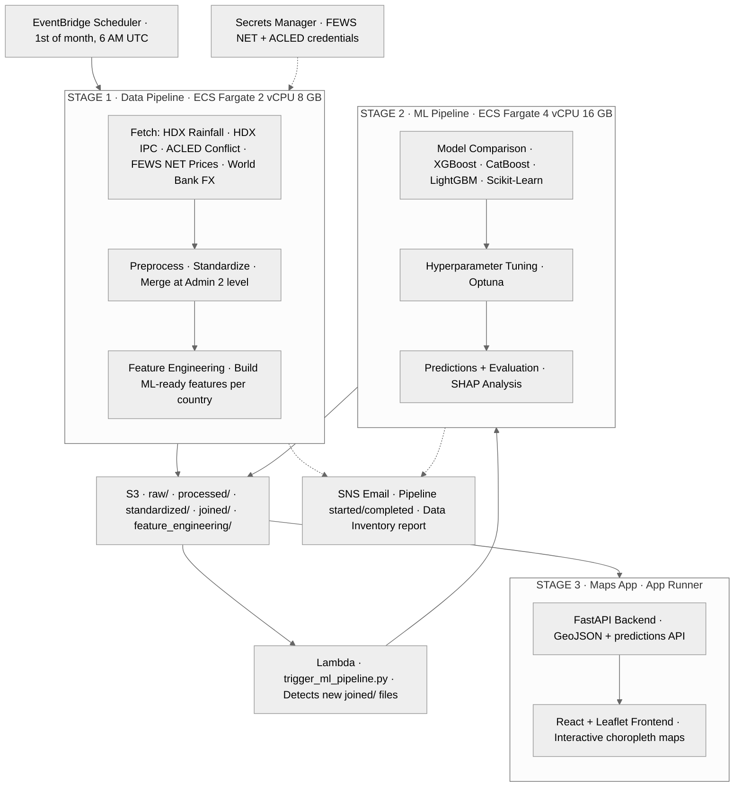

# WFP Food Security Forecasting — AWS Case Study

> **Capstone** — UC Berkeley MIDS DATASCI 210, 2026. Client: **World Food Programme (WFP)**.
> **Team:** Shikha Sharma, [Denvir Higgins](https://github.com/denvir-py), [Margaret Lubega](https://github.com/margaretlubega), [Lichen Wong](https://github.com/fan005mids).

A production AWS pipeline that predicts **IPC Phase 3+ food insecurity** (crisis level or worse) at the admin-2 district level across four Sub-Saharan African countries — **Cameroon, DR Congo, Mozambique, and Nigeria** — running automatically each month.

WFP is integrating the pipeline into their operational forecasting workflow, so the data and ML pipeline source code is not redistributed here. **This directory documents the AWS architecture and contains the deployable infrastructure-as-code artifacts.**

## Why this matters

WFP coordinates humanitarian food assistance for hundreds of millions of people. Early warning of where conditions are deteriorating is critical for pre-positioning aid before crises peak. The IPC (Integrated Food Security Phase Classification) is the international standard for food-insecurity severity on a 1–5 scale; Phase 3 and above represents crisis conditions requiring urgent humanitarian response.

This system replaces an ad-hoc manual workflow with a monthly, automated, district-level forecast across **admin-2 level districts** in four countries, drawing on six external data sources.

## Architecture



## AWS services and the role each plays

| Service | What it does here |
|---|---|
| **EventBridge Scheduler** | Cron trigger on the 1st of each month at 06:00 UTC. Invokes the Stage-1 ECS task via `ecs:RunTask`. |
| **ECS Fargate (Stage 1)** | Serverless container running the data pipeline. 2 vCPU, 8 GB RAM. Fetches from six external APIs, preprocesses, and writes to S3. |
| **ECS Fargate (Stage 2)** | Larger serverless container running the ML pipeline. 4 vCPU, 16 GB RAM. Per-country model comparison, Optuna tuning, SHAP analysis. |
| **S3** | Multi-stage data lake. Each stage writes to a distinct prefix (`raw/`, `processed/`, `standardized/`, `joined/`, `feature_engineering/`, `models/`, `predictions/`). |
| **Lambda** | Event-driven bridge between stages. Triggered by S3 PUT on `joined/`, fans out one `ecs:RunTask` per country. |
| **Secrets Manager** | Stores FEWS NET (JWT) and ACLED (OAuth) credentials. ECS task definition references them via `valueFrom`, so secrets never appear in environment variables or container images. |
| **SNS** | Email notifications on pipeline start, completion, and failure. Includes a generated data-inventory report. |
| **CloudWatch Logs** | `/ecs/wfp-data-pipeline` and `/ecs/wfp-ml-pipeline` log groups capture all container output. |
| **ECR** | Two image repositories — one per pipeline. Tagged `:latest` for the monthly run. |
| **App Runner** | Hosts the FastAPI + React choropleth map viewer that consumes prediction outputs from S3. |
| **IAM** | Three roles: ECS execution role (image pull + log write + Secrets read), ECS task role (S3 read/write), EventBridge scheduler role (`ecs:RunTask` + `iam:PassRole`). |

## Key design decisions

- **Fargate over Lambda for the heavy jobs** — both pipelines exceed Lambda's 15-minute limit and 10 GB ephemeral storage. Fargate's longer timeouts and configurable RAM/CPU made it the right fit; we still use Lambda as the lightweight S3→ECS bridge.
- **Two-stage pipeline with S3 in the middle** — decouples data ingestion from modeling so the ML stage can be re-run independently against stable joined data, and so a partial failure on one country doesn't block the others.
- **Per-country ML fan-out via Lambda** — each country gets its own ECS task triggered in parallel from the same S3 event, scaling horizontally without orchestration overhead.
- **Secrets Manager `valueFrom` references in the task definition** — credentials are never baked into images or shown in `docker inspect` / process listings. Rotating a credential is a Secrets Manager change with no redeploy.
- **`__AWS_ACCOUNT_ID__` placeholders in all IaC templates** — the JSON manifests in [infra/](infra/) are account-agnostic. The setup script substitutes the placeholder at deploy time so the same templates work in any AWS account.

## What's in this directory

```
capstone/
├── README.md                ← this case study
├── Dockerfile.data          ← container build for Stage 1
├── Dockerfile.ml            ← container build for Stage 2
├── .dockerignore
├── infra/                   ← Infrastructure-as-Code
│   ├── README.md            ← setup walkthrough with architecture diagram
│   ├── eventbridge-schedule.json
│   ├── eventbridge-ecs-policy.json
│   ├── eventbridge-trust-policy.json
│   ├── task-definition-data.json
│   └── setup_data_pipeline.sh
└── docs/
    └── aws_architecture.md  ← detailed architecture reference
```

## What's not in this directory (and why)

WFP is integrating this pipeline into their operational forecasting workflow, so the following are held under client license and are not redistributed:

- The **data pipeline source** (fetchers for HDX / ACLED / FEWS NET / World Bank, preprocessing, merging, feature engineering).
- The **ML pipeline source** (model comparison, Optuna tuning, prediction, SHAP analysis, backtesting).
- The **maps application source** (FastAPI backend and React frontend).
- The **notebooks** (EDA, prototyping, backtesting) and the **test suite**.
- Any **trained model artifacts**, **feature files**, and **prediction outputs**.

The infrastructure artifacts in this repo are sufficient to understand the deployment topology and to reproduce an equivalent pipeline against your own application code.

## Tech stack reference

- **Cloud**: AWS (EventBridge, ECS Fargate, S3, Lambda, App Runner, Secrets Manager, SNS, CloudWatch, ECR, IAM)
- **Containers**: Docker, ECR
- **Languages**: Python 3.12, Bash
- **ML**: XGBoost, CatBoost, LightGBM, scikit-learn, Optuna, SHAP
- **Frontend**: React + Vite + Leaflet
- **Backend**: FastAPI
- **Data sources**: HDX (rainfall, IPC, admin boundaries), ACLED (conflict events), FEWS NET (market prices), World Bank (RTFX exchange rates)

## Countries and coverage

| ISO3 | Country | IPC data range |
|---|---|---|
| CMR | Cameroon | Oct 2020 – Oct 2025 |
| COD | DR Congo | Jun 2017 – Sep 2025 |
| MOZ | Mozambique | May 2017 – Nov 2025 |
| NGA | Nigeria | Oct 2020 – Sep 2025 |

## My role

I owned the AWS infrastructure design and IaC — EventBridge schedule, ECS task definitions, IAM policies, and the S3 event-driven Lambda trigger that fans out per-country ML tasks.

On the modeling side, I wrote all the API fetchers (HDX, ACLED, FEWS NET, World Bank) and the multi-source merge code. I built the model comparison and tuning code, selecting the best model/ensemble per country across three prediction horizons: **nowcast, 3-month, and 8-month**.

Data preprocessing and the maps frontend (React + Leaflet) were owned by [Denvir Higgins](https://github.com/denvir-py); feature engineering by [Margaret Lubega](https://github.com/margaretlubega); model evaluation and SHAP analysis by [Lichen Wong](https://github.com/fan005mids).

## References

- George Wen. *[Serverless Data Ingestion and Pre-Processing with AWS Lambda and ECS Fargate](https://medium.com/@georgewen7/serverless-data-ingestion-and-pre-processing-with-aws-lambda-and-ecs-fargate-806e6ceca755).* Reference for the EventBridge → ECS Fargate → S3 → Lambda fan-out pattern used in Stages 1–2.

---

**Course:** UC Berkeley MIDS DATASCI 210 — Capstone. **Client:** World Food Programme.
