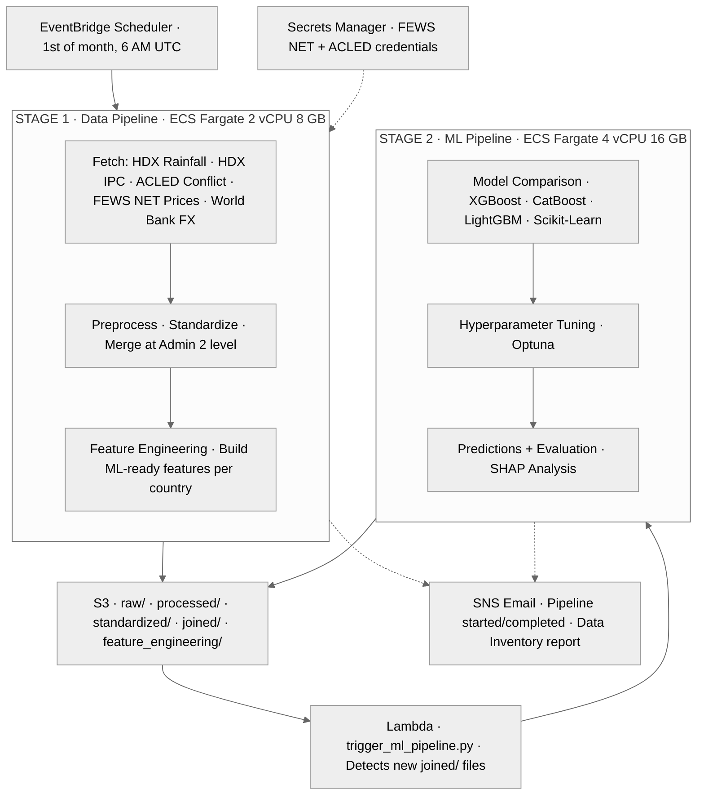

# AWS Deployment Architecture — WFP Food Security Pipeline

## Architecture Diagram



## Data Sources

| Source | API Endpoint | Auth | Data Type |
|--------|-------------|------|-----------|
| HDX | CKAN API (data.humdata.org) | None | Rainfall, IPC, Admin Boundaries |
| ACLED | acleddata.com/api/acled/read | OAuth | Conflict Events |
| FEWS NET | fdw.fews.net/api/marketpricefacts | JWT | Commodity Prices |
| World Bank | microdata.worldbank.org/api/tables/data | None | Exchange Rates (RTFX) |

## Infrastructure Components

| Component | Service | Config |
|-----------|---------|--------|
| Data Pipeline | ECS Fargate | 2 vCPU, 8 GB RAM |
| ML Pipeline | ECS Fargate | 4 vCPU, 16 GB RAM |
| Scheduler | EventBridge | Monthly (1st, 6 AM UTC) |
| S3 Event Trigger | Lambda | trigger_ml_pipeline.py |
| Credentials | Secrets Manager | FEWS NET + ACLED |
| Logs | CloudWatch | /ecs/wfp-data-pipeline |
| Notifications | SNS | Email on start/complete/fail |
| Container Registry | ECR | wfp-data-pipeline, wfp-ml-pipeline |
| Maps App | App Runner | FastAPI + React |

## Pipeline Flow

```
EventBridge (monthly cron)
  → ECS: Data Pipeline
    → Fetch from 6 APIs (HDX, ACLED, FEWS NET, World Bank)
    → Preprocess → Merge → Feature Engineering
    → Upload to S3 (joined/ + feature_engineering/)
    → SNS: "Pipeline complete" + data inventory
  → S3 Event triggers Lambda
    → ECS: ML Pipeline (per country)
      → Model comparison, tuning, predictions, SHAP analysis
      → Upload results to S3
      → SNS: "ML pipeline complete"
```

## Countries

| ISO3 | Country | IPC Data Range |
|------|---------|---------------|
| CMR | Cameroon | Oct 2020 – Oct 2025 |
| COD | DR Congo | Jun 2017 – Sep 2025 |
| MOZ | Mozambique | May 2017 – Nov 2025 |
| NGA | Nigeria | Oct 2020 – Sep 2025 |
| ETH | Ethiopia | Sep 2019 – May 2021 (limited) |
