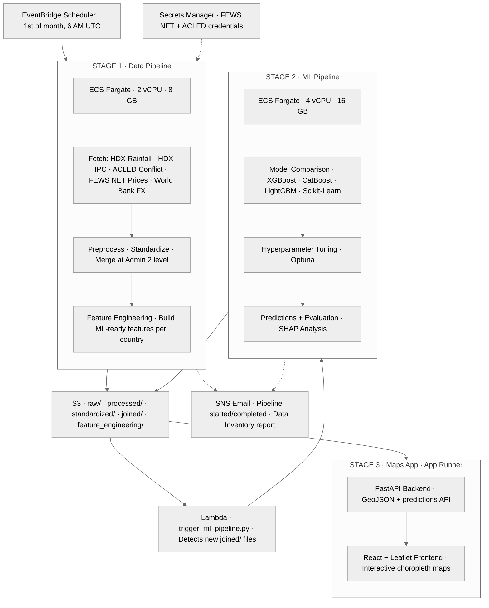

# Infrastructure — WFP Food Security Pipeline

AWS resources for automated monthly execution of the data and ML pipelines.

## Architecture



## Prerequisites

- `AWS_ACCOUNT_ID` env var set: `export AWS_ACCOUNT_ID=<your-account-id>`
- AWS CLI configured with profile `wfp`
- Docker installed
- Existing ECS cluster: `wfp-ml-cluster`
- Existing S3 bucket: `wfp-ml-pipeline-data-${AWS_ACCOUNT_ID}`
- Existing IAM roles: `wfp-ecs-execution-role`, `wfp-ecs-task-role`

## Files

| File | Purpose |
|---|---|
| `setup_data_pipeline.sh` | Step-by-step setup guide — review and run each section manually |
| `task-definition-data.json` | ECS task definition for the data pipeline container |
| `eventbridge-schedule.json` | Monthly EventBridge Scheduler configuration |
| `eventbridge-ecs-policy.json` | IAM policy granting EventBridge permission to run ECS tasks |
| `eventbridge-trust-policy.json` | Trust policy for the EventBridge scheduler IAM role |

## Setup

### 1. Set your AWS Account ID

All scripts and JSON templates use `AWS_ACCOUNT_ID` at runtime — no account IDs are hardcoded.

```bash
export AWS_ACCOUNT_ID=$(aws sts get-caller-identity --query Account --output text --profile wfp)
```

### 2. Run the setup guide

`setup_data_pipeline.sh` is a guided script — **do not run it end-to-end**. Work through each numbered step:

1. Store API credentials in Secrets Manager (FEWS NET, ACLED)
2. Push data pipeline Docker image to ECR
3. Register the ECS task definition
4. Create the EventBridge IAM role and attach policies
5. Create the EventBridge schedule

The setup script automatically substitutes `__AWS_ACCOUNT_ID__` placeholders in the JSON templates (`task-definition-data.json`, `eventbridge-schedule.json`, `eventbridge-ecs-policy.json`) with your `AWS_ACCOUNT_ID` value.

```bash
# Example: build and push the data pipeline image
REGION=us-east-1
aws ecr get-login-password --region $REGION --profile wfp \
  | docker login --username AWS --password-stdin $AWS_ACCOUNT_ID.dkr.ecr.$REGION.amazonaws.com

docker build -f Dockerfile.data -t wfp-data-pipeline .
docker tag wfp-data-pipeline $AWS_ACCOUNT_ID.dkr.ecr.$REGION.amazonaws.com/wfp-data-pipeline:latest
docker push $AWS_ACCOUNT_ID.dkr.ecr.$REGION.amazonaws.com/wfp-data-pipeline:latest
```

### 3. Runtime entrypoints

The ECS entrypoint scripts (`scripts/entrypoint.sh`, `scripts/entrypoint_data.sh`) expect `S3_BUCKET` to be set in the ECS task definition environment. The bucket name includes the account ID (e.g. `s3://wfp-ml-pipeline-data-${AWS_ACCOUNT_ID}`).

## IAM Roles

| Role | Used by | Grants |
|---|---|---|
| `wfp-ecs-execution-role` | ECS agent | Pull ECR images, write CloudWatch logs, read Secrets Manager |
| `wfp-ecs-task-role` | Running container | Read/write S3 bucket |
| `eventbridge-wfp-scheduler-role` | EventBridge | `ecs:RunTask` + `iam:PassRole` for the ECS roles |
