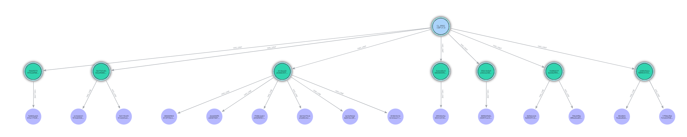

# Ontology-Driven Cybersecurity Policy Generation

**Course:** UC Berkeley MIDS DATASCI 266 — Natural Language Processing with Deep Learning.
**Authors:** [Chris Rezny](https://github.com/crezny), Shikha Sharma.
**Full report:** [Ontology-Driven Cybersecurity Policy Generation.pdf](Ontology-Driven%20Cybersecurity%20Policy%20Generation.pdf)

## Overview

Ontology-grounded LLM generation of cybersecurity policy clauses for SOC 2 and NIST CSF frameworks. Framework hierarchies are modeled as a Neo4j knowledge graph; CyberBERT+ extracts atomic requirements that condition retrieval-augmented generation. A Multi-Dimensional Similarity (MDS) metric combines lexical precision, ontology coverage, semantic faithfulness, and RAGAS scoring to evaluate generated policies.

## Result

Across 347 test policy sections spanning SOC 2 and NIST CSF, four ungrounded LLMs (SmolLM3, Llama-3.2-3B, Mistral-7B, Gemma-2-9B) showed high semantic similarity but very low lexical and structural alignment — confirming that semantic understanding alone is insufficient for policy drafting. Ontology-grounded prompting on Gemma-2-9B (v2.5) was the strongest configuration:

| Model | S_coverage | S_semantic_faith | S_surface | **S_MDS** |
|---|---|---|---|---|
| v1.5 (limited grounding) | 0.770 | 0.670 | 0.489 | 0.638 |
| **v2.5 (full ontology + KG)** | **0.796** | **0.742** | 0.457 | **0.664** |
| v3.7 (LoRA fine-tuning) | 0.785 | 0.510 | 0.493 | 0.562 |

LoRA fine-tuning on SME-written clauses (v3.7) underperformed in semantic faithfulness, indicating that fine-tuning reinforced stylistic patterns without improving factual alignment. Full methodology, scoring equations, and discussion in the [final report PDF](Ontology-Driven%20Cybersecurity%20Policy%20Generation.pdf).

## Contributions

**Chris Rezny ([@crezny](https://github.com/crezny))**
- Built the ontology-keyword and framework knowledge graphs and constructed the training/test dataset
- Implemented the RAG pipeline (PostgreSQL for ontology keywords, Neo4j for the policy framework KG)
- Conducted RAG prompt optimization and added RAGAS, LLM judge, and SpaCy evaluation metrics to MDS
- Fine-tuned the production model (Gemma-2-9B) with LoRA on the optimized RAG prompt (v3.7)

**Shikha Sharma**
- Built the initial baseline — four ungrounded LLM experiments across two embedding models
- Implemented the initial version of the MDS scoring framework
- Implemented the initial LoRA and DPO fine-tuning pipelines for the RAG model
- Drafted the milestone document (baseline results + discussion) and the initial final report

**Joint**
- Project conceptualization and experimental design
- Review of milestone, baseline, RAG, and final-report results

---

> The technical content below was authored during development and includes planned-but-not-shipped components (agentic logic, additional validators). See the [final report PDF](Ontology-Driven%20Cybersecurity%20Policy%20Generation.pdf) for what was actually built and evaluated.

### Data Preparation & Normalization

All policy content originated from a mix of Word (.docx) and PDF templates spanning multiple cybersecurity frameworks (NIST CSF, SOC 2, etc.). These source documents were converted, cleaned, and normalized into plain-text files to create a reusable dataset for model training, ontology mapping, and evaluation.

#### 1. Text Extraction

* Word documents were parsed using the Microsoft Word COM library (win32com.client), which ensured accurate paragraph order, spacing, and section detection.
* PDFs were processed via PyMuPDF or pdfminer.six, depending on layout consistency.
* Non-content elements such as headers, footers, tables, page numbers, and watermarks were stripped to isolate true policy language.
* The resulting raw text files were saved under data/policies/ for versioned access.

#### 2. PII Detection & Redaction

* Each extracted policy text was scanned for personally identifiable information (PII) using a transformer-based NER pipeline (detect_pii()), which identified entities such as names, emails, phone numbers, and addresses.
* Matches were scored by confidence and reviewed; any entity exceeding a set threshold (≥ 0.50) was redacted or replaced with placeholders (e.g., [EMAIL], [NAME]).
* This ensured that no sensitive or client-specific data persisted in the training or evaluation corpus, keeping all model development compliant and privacy-safe.

#### 3. Normalization

* Cleaned text was standardized to UTF-8 .txt format and processed with regex rules to remove artifacts such as bullets (•), double spaces, and inconsistent indentation.
* Numbering patterns (1., 1.1, A., I.) were unified into a hierarchical clause structure.
* Metadata — including policy_id, policy_title, source_framework, and company_type — was embedded into the output to support downstream joins and tracking.

#### 4. Structuring & Hashing

Normalized text was segmented into sections and clauses using rule-based pattern matching refined over multiple iterations.
* Each clause received a SHA-256 hash to guarantee uniqueness, traceability, and version control across frameworks.
* The resulting dataset contained approximately 1,600 unique policy–phrase combinations, representing distinct statements or requirements.
* Policies were then loaded into the database for further reference in the model creation (see image 1)
<br/>
<br/>
<br/>


<sub>Image 1: &nbsp;&nbsp; Single policy hierarchy of Policy --> PolicyUnit (section) --> Policy Line </sub>

<br/>


#### 5. Dataset Assembly & Prompt Generation

* The normalized corpus was loaded into pandas DataFrames and exported to .csv files (e.g., policy_prompts_variants.csv, baseline_llama3_outputs.csv).
* For the baseline model, four prompt variants were generated per policy phrase to test prompt sensitivity: variations in instruction phrasing, context inclusion, and ontology framing.
* This enabled systematic comparison of how subtle prompt wording changes influence model coherence and alignment.
* All outputs were indexed by policy_id, section_id, and phrase_id to ensure alignment across ontology, framework, and model results.

This end-to-end process yielded a clean, privacy-safe, and normalized text corpus, forming the foundation for the Llama-3 baseline, ontology-augmented (V1), knowledge-graph-enhanced (V2), and SME-aligned (V3) model stages.
<br/>
<br/>
<br/>
### How Ontologies are mapped to Policy Phrases.
The mapping process occurs in two stages, implemented across two notebooks:

1. Metadata Extraction (1-metadata_extrator.ipynb)

Each clause or phrase in a policy document is processed using a sentence transformer (sentence-transformers/all-mpnet-base-v2) to generate semantic embeddings and extract key terms.
This step produces a structured set of keywords and representative phrases for each policy section, forming the metadata foundation used for ontology alignment.

The resulting metadata is saved as individual JSON files under data/ontology_metadata/, with one file per framework.
Although policies may appear across multiple frameworks, each version contains framework-specific contextual variations.

2. Ontology Mapping (2-ontology_extractor.ipynb)

The metadata generated in Step 1 is then processed through a SecureBERT+ model, which computes semantic similarity between the extracted keywords and the ontology definitions provided in ontology.json.

This notebook identifies conceptual alignments between policy phrases and ontology entities, highlighting thematic overlaps such as control objectives, processes, or compliance terms.

The resulting similarity mappings are exported and later ingested into Neo4j to extend the cybersecurity knowledge graph — linking individual policy phrases to ontology nodes, frameworks, and control hierarchies.

```mermaid
flowchart LR
  %% theme + elk renderer
  %%{
    init: {
      "themeVariables": { 
        "clusterBkg": "#f3f3f3",
        "clusterBorder": "#999",
        "labelBackground": "#ffffff",
        "edgeLabelBackground": "#ffffff",
        "edgeLabelBorder": "#999",
        "labelBorder": "#999"
      }
    }
  }%%
  %%{init: {"flowchart": {"defaultRenderer": "elk"}}}%%

  %% STYLES
  classDef box fill:#fff,stroke:#333,stroke-width:1px,rx:8px,ry:8px;
  classDef Neo4j fill:#C9E4FF,stroke:#333,stroke-width:1px,rx:8px,ry:8px;
  classDef Conductor fill:#E6E6E6,stroke:#333,stroke-width:1px,rx:8px,ry:8px;
  classDef lightTeal fill:#5aa9c9,stroke:#333,stroke-width:1px,color:#fff,rx:8px,ry:8px;
  classDef Agents fill:#C2F0C2,stroke:#333,stroke-width:1px,rx:8px,ry:8px;
  classDef Client fill:#FFF6BF,stroke:#333,stroke-width:1px,rx:8px,ry:8px;
  classDef Output fill:#FFD9B3,stroke:#333,stroke-width:1px,rx:8px,ry:8px;
  classDef Validation fill:#E4D3F8,stroke:#333,stroke-width:1px,rx:8px,ry:8px;

   %% NODES

  subgraph ONT["Ontology"]
    direction TB
    OA1["Ontology Area"]:::lightTeal
    OA2["Ontology Area"]:::lightTeal
    OA3["Ontology Area"]:::lightTeal
  end
  class ONT teal

  subgraph META["Ontology Metadata"]
    direction TB
    IA["Implicit (Semantic) Applicability<br/>SecureBERT+"]:::lightTeal
    SV["SME Verification"]:::lightTeal
  end
  class META teal

  subgraph POL["Policy Section"]
    direction TB
    PS1["Section Phrase"]:::lightTeal
    PS2["Section Phrase"]:::lightTeal
    PS3["Section Phrase"]:::lightTeal
  end
  class POL teal

  subgraph FW["Framework"]
    direction TB
    F1["Control Area Description"]:::lightTeal
    F2["Sub Control Area Description"]:::lightTeal
  end
  class FW teal

  %% FLOWS
  
  OA1 --> IA
  OA2 --> IA
  OA3 --> IA
  SV --> PS1
  SV --> PS2
  SV --> PS3
  SV --> F2
  SV --> F1
  

  %% relation inside metadata
  IA --> SV


 ```

### Baseline Model (Baseline Model.ipynb)

Uses a quantized (GGUF) Meta-Llama-3-8B-Instruct for faster, lighter local inference. Runs prompt variants in mini-batches, then merges the generations back to the canonical policy base phrases (by policy/section/phrase IDs) to produce the baseline output dataset for comparison.  this output can then be scored for accuracy using standard scoring metrics like Scentence Transformer or LLM embeding for embeding similarity or LLM bases STS for an accuracy scale

<br/>
<br/>

## V1.5 Model — Limited Ontology Grounding
The V1 model will extend the baseline by injecting ontology context directly into the prompt, allowing the LLM to generate policy text that reflects both the policy phrase and its aligned ontology terms or areas. Unlike later versions, this iteration will not yet use the Neo4j knowledge graph—all ontology data will be provided inline within the prompt. The goal is to evaluate how much contextual grounding from ontology descriptions alone improves relevance, structure, and accuracy of generated policies.
Implementation should focus on designing prompt templates that concatenate the policy base phrase, framework metadata, and related ontology summaries, then run inference under consistent conditions to compare performance against the baseline.
```mermaid
flowchart LR
  %% theme + elk renderer
  %%{
    init: {
      "themeVariables": { 
        "clusterBkg": "#f3f3f3",
        "clusterBorder": "#999",
        "labelBackground": "#ffffff",
        "edgeLabelBackground": "#ffffff",
        "edgeLabelBorder": "#999",
        "labelBorder": "#999"
      }
    }
  }%%
  %%{init: {"flowchart": {"defaultRenderer": "elk"}}}%%

  %% STYLES
  classDef box fill:#fff,stroke:#333,stroke-width:1px,rx:8px,ry:8px;
  classDef Neo4j fill:#C9E4FF,stroke:#333,stroke-width:1px,rx:8px,ry:8px;
  classDef Conductor fill:#E6E6E6,stroke:#333,stroke-width:1px,rx:8px,ry:8px;
  classDef lightTeal fill:#5aa9c9,stroke:#333,stroke-width:1px,color:#fff,rx:8px,ry:8px;
  classDef Agents fill:#C2F0C2,stroke:#333,stroke-width:1px,rx:8px,ry:8px;
  classDef Client fill:#FFF6BF,stroke:#333,stroke-width:1px,rx:8px,ry:8px;
  classDef Output fill:#FFD9B3,stroke:#333,stroke-width:1px,rx:8px,ry:8px;
  classDef Validation fill:#E4D3F8,stroke:#333,stroke-width:1px,rx:8px,ry:8px;

   %% NODES

  subgraph ONT["Model Prompt Inputs"]
    direction LR
    OA1["Instruction Prompt"]:::Validation
    OA2["Company Ontology "]:::Conductor
    OA3["Ontology Prompt"]:::Agents
  end

  subgraph META["Test Model"]
    direction TB
    BM["Base model<br/>Llama-3-8B-Instruct"]:::lightTeal
  end
 
  PS1["Generated Policy Phrase"]:::box
  
  %% FLOWS
  OA1 --> BM
  OA2 --> BM
  OA3 --> BM

  BM --> PS1
  

 ```
 <br/>  
<br/>  

## V2.5 Model — Full Ontology + Knowledge Graph
The V2 model will build on V1 by integrating the Neo4j knowledge graph (KG) to provide structured context alongside ontology mappings. In this version, prompts will dynamically pull related nodes and relationships—such as framework controls, sub-controls, and linked ontology terms—directly from the KG. This enables the model to reason over hierarchical and relational data rather than static text.
Implementation should focus on developing a context retrieval layer that queries Neo4j for relevant ontology and framework entities based on each policy phrase, then injects that graph-derived context into the prompt. The goal is to assess how knowledge-grounded prompting improves semantic accuracy, coverage, and policy alignment compared to the V1 ontology-only approach.
```mermaid
flowchart LR
  %% theme + elk renderer
  %%{
    init: {
      "themeVariables": { 
        "clusterBkg": "#f3f3f3",
        "clusterBorder": "#999",
        "labelBackground": "#ffffff",
        "edgeLabelBackground": "#ffffff",
        "edgeLabelBorder": "#999",
        "labelBorder": "#999"
      }
    }
  }%%
  %%{init: {"flowchart": {"defaultRenderer": "elk"}}}%%

  %% STYLES
  classDef box fill:#fff,stroke:#333,stroke-width:1px,rx:8px,ry:8px;
  classDef Neo4j fill:#C9E4FF,stroke:#333,stroke-width:1px,rx:8px,ry:8px;
  classDef Conductor fill:#E6E6E6,stroke:#333,stroke-width:1px,rx:8px,ry:8px;
  classDef lightTeal fill:#5aa9c9,stroke:#333,stroke-width:1px,color:#fff,rx:8px,ry:8px;
  classDef Agents fill:#C2F0C2,stroke:#333,stroke-width:1px,rx:8px,ry:8px;
  classDef Client fill:#FFF6BF,stroke:#333,stroke-width:1px,rx:8px,ry:8px;
  classDef Output fill:#FFD9B3,stroke:#333,stroke-width:1px,rx:8px,ry:8px;
  classDef Validation fill:#E4D3F8,stroke:#333,stroke-width:1px,rx:8px,ry:8px;

   %% NODES

  subgraph ONT["Model Prompt Inputs"]
    direction LR
    OA1["Instruction Prompt"]:::Validation
    OA2["Company Ontology "]:::Conductor
    OA3["Ontology Prompt"]:::Agents
  end

  subgraph META["Test Model"]
    direction TB
    BM["Base model<br/>Llama-3-8B-Instruct"]:::lightTeal
  end

  subgraph KG["Neo4j Knowledge Graph"]
    direction TB
    KG1["Policy to Section Mapping"]:::Neo4j
    KG2["Policy to Framework Mapping"]:::Neo4j
    KG3["Ontology Mapped to Policy Phrase/Section"]:::Neo4j
  end
 
  PS1["Generated Policy Phrase"]:::box
 
  
  %% FLOWS
  OA1 --> BM
  OA2 --> BM
  OA3 --> BM

  KG1 --> BM
  KG2 --> BM
  KG3 --> BM


  BM --> PS1
  

 ```
<br/>  
<br/>

## V3.7 Model — LoRA Fine-Tuning

V3 turns V2’s graph-grounded outputs into SME survey items (top-k candidates, highlighted uncertainties, and counterfactuals). SME rankings, edits, and rationales are captured as preference data, which is then used to change model behavior via one or more of: prompt-weight tuning, pairwise/DPO-style preference optimization, lightweight LoRA fine-tuning, and reward-model or rubric scoring. The pipeline should (1) auto-generate surveys from V2 context, (2) log SME signals back into the KG as weights/tags, (3) train/update adapters or preference weights, and (4) re-evaluate against Baseline/V1/V2 with the same metrics (embedding similarity + LLM-STS + SME acceptance). The goal is a human-aligned policy drafter that reflects SME preferences, not just ontology/graph context.
 ```mermaid
flowchart LR
  %% theme + elk renderer
  %%{
    init: {
      "themeVariables": { 
        "clusterBkg": "#f3f3f3",
        "clusterBorder": "#999",
        "labelBackground": "#ffffff",
        "edgeLabelBackground": "#ffffff",
        "edgeLabelBorder": "#999",
        "labelBorder": "#999"
      }
    }
  }%%
  %%{init: {"flowchart": {"defaultRenderer": "elk"}}}%%

  %% STYLES
  classDef box fill:#fff,stroke:#333,stroke-width:1px,rx:8px,ry:8px;
  classDef Neo4j fill:#C9E4FF,stroke:#333,stroke-width:1px,rx:8px,ry:8px;
  classDef Conductor fill:#E6E6E6,stroke:#333,stroke-width:1px,rx:8px,ry:8px;
  classDef lightTeal fill:#5aa9c9,stroke:#333,stroke-width:1px,color:#fff,rx:8px,ry:8px;
  classDef Agents fill:#C2F0C2,stroke:#333,stroke-width:1px,rx:8px,ry:8px;
  classDef Client fill:#FFF6BF,stroke:#333,stroke-width:1px,rx:8px,ry:8px;
  classDef Output fill:#FFD9B3,stroke:#333,stroke-width:1px,rx:8px,ry:8px;
  classDef Validation fill:#E4D3F8,stroke:#333,stroke-width:1px,rx:8px,ry:8px;

   %% NODES

  subgraph ONT["Model Prompt Inputs"]
    direction LR
    OA1["Instruction Prompt"]:::Validation
    OA2["Company Ontology "]:::Conductor
    OA3["Ontology Prompt"]:::Agents
  end

  subgraph META["Test Model"]
    direction TB
    BM["Base model<br/>Llama-3-8B-Instruct"]:::lightTeal
  end

  subgraph KG["Neo4j Knowledge Graph"]
    direction TB
    KG1["Policy to Section Mapping"]:::Neo4j
    KG2["Policy to Framework Mapping"]:::Neo4j
    KG3["Ontology Mapped to Policy Phrase/Section"]:::Neo4j
  end
 
  PS1["Generated Policy Phrase"]:::box
  
  SME["SME  Supervised Training<br/>A/B Testing
  "]:::Output
  
  %% FLOWS
  OA1 --> BM
  OA2 --> BM
  OA3 --> BM

  KG1 --> BM
  KG2 --> BM
  KG3 --> BM

  SME --> BM

  BM --> PS1
  

 ```
<br/>  
<br/>

## Scoring & Evaluation

All model outputs — from the Baseline, V1, V2, and V3 — will be evaluated using a consistent, multi-layer scoring framework. Each generated clause or phrase is scored at the phrase level, keyed by policy_id, section_id, and phrase_id, then aggregated at the section, policy, and framework levels.

### Automated Metrics

Every model output is automatically scored on multiple dimensions:

* Cosine Similarity – Semantic match between the generated text and the reference clause using embeddings (all-mpnet-base-v2).
* LLM-STS Score – Sentence-level semantic similarity rated by an LLM on a fixed numeric scale.
* Ontology Coherence – Alignment between the generated text and its associated ontology node(s).
* Coverage % – Proportion of required elements (keywords or control items) present in the text.
* Structure Compliance – Adherence to policy formatting and tone requirements.
* Length Penalty – Soft normalization for overly short or long outputs.

#### Composite score formula

$$
Composite_{Score} =
0.35 \times Cosine +
0.25 \times LLM_{STS} +
0.20 \times OntologyCoherence +
0.10 \times Coverage +
0.05 \times Structure +
0.05 \times LengthPenalty
$$

<div style="font-size: 0.85em; line-height: 1.6;">

**Where:**  
- **Cosine** — Semantic similarity between generated and reference text using embedding cosine similarity (`all-mpnet-base-v2`).  
- **LLM_STS** — Sentence-level semantic similarity rated by an LLM (Semantic Textual Similarity).  
- **OntologyCoherence** — Degree of alignment between the output and the expected ontology node(s).  
- **Coverage** — Proportion of required concepts or control elements present in the text.  
- **Structure** — Adherence to formatting, tone, and policy structure conventions.  
- **LengthPenalty** — Adjustment for excessively short or long responses relative to target token length.  

</div>

This composite metric provides a consistent, quantitative basis for comparing model versions without introducing human bias from SME feedback.

Each score record includes model identifiers, quantization type, prompt hash, and generation parameters for reproducibility.

### SME Evaluation (Baseline vs V3)

SME evaluation serves as a separate, human validation stage, not a weighted component of the composite score.
SMEs will perform blind pairwise evaluations between Baseline and V3 outputs for the same policy phrase, selecting the version that best reflects accuracy, clarity, and compliance intent.
These comparisons yield a final human-validated efficacy score that measures improvement in real-world quality and behavior alignment, independent of automated scoring. SME responses may also be used later as training data for preference tuning in future iterations.

### Aggregation & Reporting

Scores will be aggregated by section, policy, and framework to produce leaderboards and visual summaries. Results will be stored in structured CSV/Parquet format with complete provenance metadata for transparent version tracking.

<br/>
<br/>
<br/>

## Project Filestructure

```text
cybersecurity_policy_generation/
├─ data/
│  ├─ frameworks/                     # NIST CSF, SOC 2, etc. in .json with control families and mappings
│  ├─ policies/                       # ~100 normalized .txt policy documents, PII redacted
│  ├─ baseline_llama3_outputs.csv     # raw baseline output from Llama-3.2-3B
│  ├─ created and merged outputs.csv  # baseline output joined with full policy text, used in scoring
│  ├─ datasource.csv                  # parsed policies in CSV form with obfuscated client references
│  └─ policy_prompts_variants.csv     # four prompt variations (A–D) per policy section
│
├─ Document Parsing/                  # notebooks converting policy .txt files into datasource.csv
│
├─ KG Construction/
│  ├─ 1-Policies to Neo4j.ipynb       # loads policies into the Neo4j KG
│  ├─ 2-Ontologies to Neo4j.ipynb     # loads ontologies from .json into Neo4j
│  └─ 3-Ontologies-Line to Neo4j.ipynb # semantic match of ontologies to policy lines via CyberBERT+
│
├─ Baseline Model.ipynb               # four ungrounded LLM baselines (SmolLM3, Llama-3.2-3B, Mistral-7B, Gemma-2-9B)
├─ V1_5_and_V2_5_Prompt_Creation.ipynb # ontology-grounded prompt templates (v1.5 + v2.5)
├─ V1_Model.ipynb / V2_Model.ipynb    # ontology-grounded generation runs
├─ LoRA Train.ipynb                   # LoRA fine-tuning of Gemma-2-9B (v3.7)
├─ DPO V3_7.ipynb                     # DPO fine-tuning experiments
├─ Model Comparison.ipynb             # cross-model evaluation
├─ Model Scoring.ipynb                # MDS scoring framework
└─ Ontology-Driven Cybersecurity Policy Generation.pdf
```


---

*Final scope: ontology-grounded RAG (v1.5 / v2.5) on Gemma-2-9B with a LoRA fine-tuned variant (v3.7), evaluated against four ungrounded baselines using the MDS framework. Out of scope: specialist framework agents, planner/decomposer, SME survey loop, and survey-based DPO training — these are discussed as future work in the [final report](Ontology-Driven%20Cybersecurity%20Policy%20Generation.pdf).*
