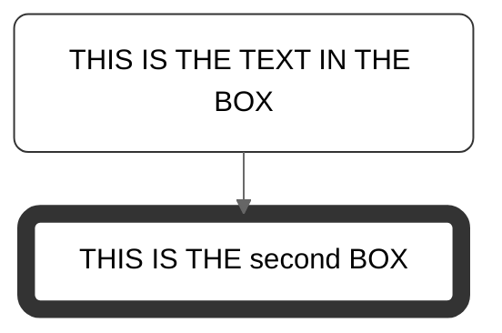

```mermaid

%%{init: {"theme": "neutral", "flowchart": {"defaultRenderer": "elk"}, "themeVariables": { 
  "clusterBkg": "#f3f3f3",
  "clusterBorder": "#999",
  "labelBackground": "#ffffff",
  "edgeLabelBackground": "#ffffff",
  "edgeLabelBorder": "#999",
  "labelBorder": "#999"
}} }%%
flowchart TB
classDef class_name fill:#fff,stroke:#333,stroke-width:1px,rx:8px,ry:8px;
classDef class_name2 fill:#fff,stroke:#333,stroke-width:10px,rx:8px,ry:8px;

BOX_NAME["THIS IS THE TEXT IN THE BOX"]:::class_name

BOX_NAME2["THIS IS THE second BOX"]:::class_name2

BOX_NAME --> BOX_NAME2

```
